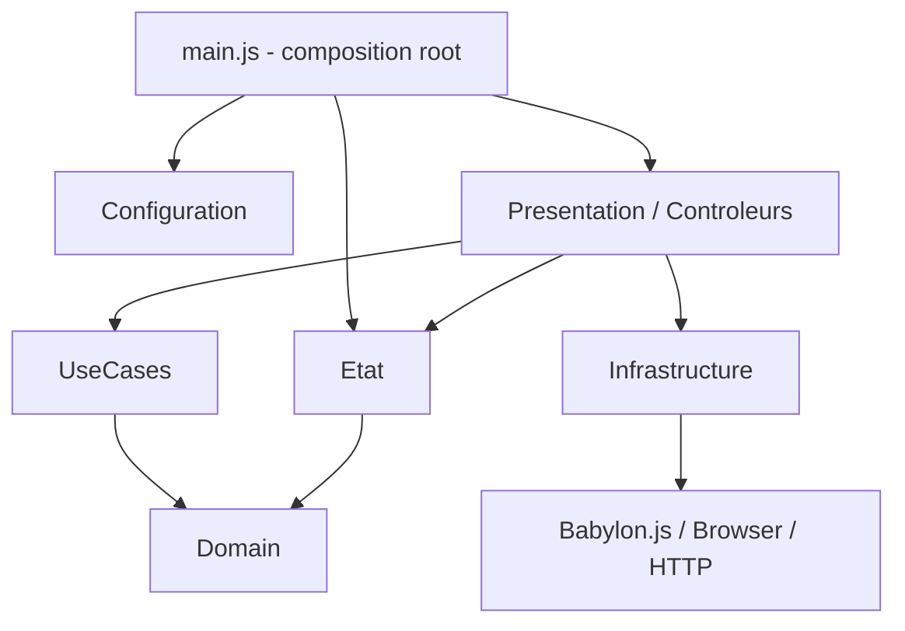

# Architecture et contexte d'ANNA V1

## 1. Rôle du système

ANNA est une application web de visualisation d'objets 3D. Elle combine :

- une scène Babylon.js ;
- une interface Babylon GUI personnalisable ;
- des aides visuelles ;
- un profil utilisateur persistant dans le navigateur ;
- quelques services PHP optionnels côté serveur.

Le point d'entrée JavaScript est `main.js`.

## 2. Vue contexte

```mermaid
flowchart LR
    U[Utilisateur] --> B[Navigateur Web]
    B --> A[ANNA - Front-end JavaScript]
    A --> L[localStorage]
    A --> M[assets/modeles]
    A --> G[assets/gui/guiTexture.json]
    A --> P1[api/lister_modeles.php]
    A --> P2[api/enregistrer_enquete.php]
    P1 --> M
    P2 --> FS[Dossier privé réponses]
    P2 --> MAIL[mail() serveur - optionnel]
```

### Frontières

ANNA ne possède pas de backend applicatif permanent pour le profil utilisateur :
- le profil est local au navigateur ;
- le serveur sert les fichiers statiques et fournit des endpoints PHP ciblés.

## 3. Vue conteneurs

### Navigateur

Contient :
- modules ES JavaScript ;
- Babylon.js ;
- scène 3D ;
- GUI Babylon ;
- post-traitements ;
- état courant ;
- profil local.

### Serveur web

Sert :
- `index.html` ;
- JavaScript/CSS ;
- GUI JSON ;
- modèles 3D et textures ;
- endpoints PHP.

### Stockages

- `localStorage` : réglages utilisateur ;
- `assets/modeles/` : modèles OBJ et ressources associées ;
- dossier privé serveur : réponses du questionnaire.

## 4. Décomposition logique



## 5. Responsabilités par couche

### `Configuration/`

Contient les valeurs modifiables :
- caméra ;
- apparence ;
- contours ;
- interface ;
- saillance ;
- sauvegarde ;
- accessibilité ;
- questionnaire.

Une valeur réglable ne doit pas être recopiée dans plusieurs contrôleurs.

### `Domain/`

Contient les objets métier indépendants de Babylon :
- paramètres interface ;
- caméra ;
- apparence ;
- contours ;
- modèle ;
- profil.

Le domaine valide les données mais ne manipule pas la GUI.

### `Etat/`

`etatApplication.js` regroupe l'état vivant de la session.

### `UseCases/`

Chaque Use Case représente une intention ciblée :
- changer une police ;
- activer la silhouette ;
- changer une texture ;
- sauvegarder un profil ;
- etc.

### `Presentation/controleurs/`

Les contrôleurs relient les contrôles GUI aux Use Cases et services.

### `Infrastructure/`

Implémentations techniques :
- Babylon ;
- GUI ;
- navigateur ;
- stockage local ;
- HTTP ;
- loupe ;
- shaders.

### `api/`

Petits endpoints PHP :
- découverte des modèles ;
- enregistrement du questionnaire ;
- configuration du destinataire.

## 6. `main.js` comme composition root

`main.js` doit principalement :
1. créer moteur, scène et GUI ;
2. instancier services et Use Cases ;
3. créer les contrôleurs ;
4. injecter les dépendances ;
5. brancher les contrôles ;
6. restaurer le profil ;
7. lancer le modèle initial ;
8. démarrer la boucle de rendu.

Les algorithmes ne doivent pas être déplacés dans `main.js`.

## 7. Concepts transverses

### État partagé

Les contrôleurs mettent à jour `etatApplication`; les services lisent ensuite l'état nécessaire.

### Asynchronisme

Le chargement et la saillance sont asynchrones. Le code cède volontairement la main au navigateur pour que la GUI reste interactive.

### V1 modulaire

Le contour actif est volontairement limité à la silhouette. Relief, contour couleur et surbrillance ne doivent pas être réintroduits dans `PostTraitSilhouette`.
