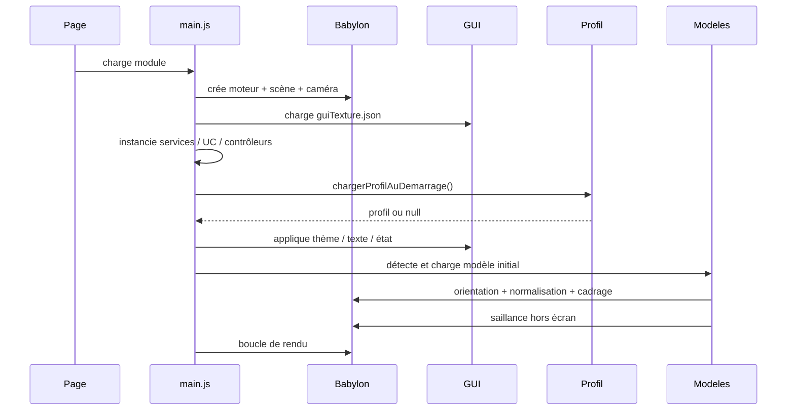
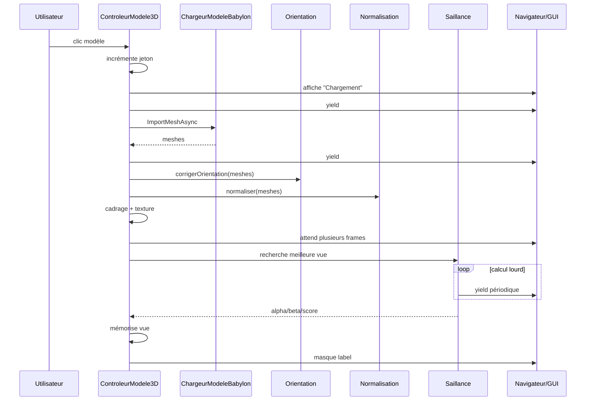
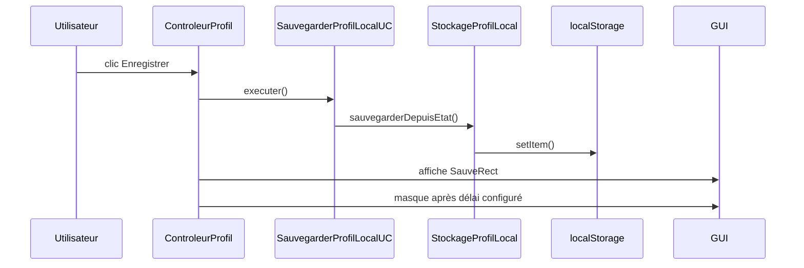
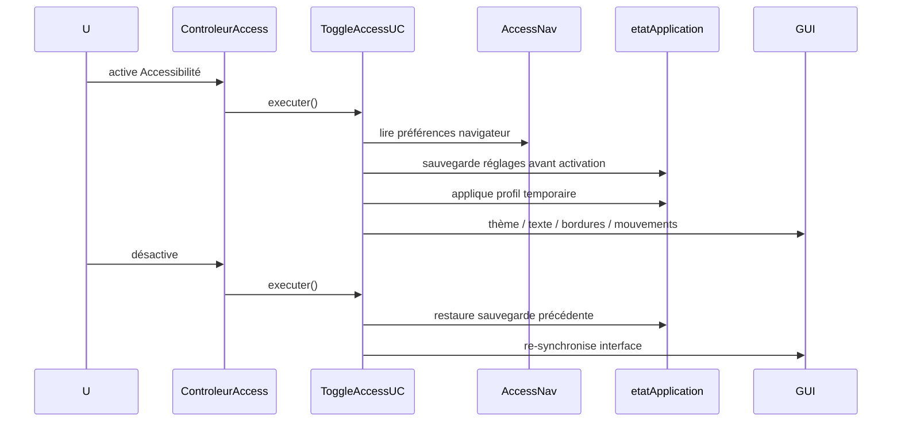

# Flux d'exécution (Runtime View)

## 1. Démarrage



## 2. Changement de modèle



### Pourquoi le jeton est nécessaire

Si l'utilisateur choisit B avant la fin du chargement de A :
- A devient obsolète ;
- ses meshes sont détruits ;
- A ne peut plus modifier caméra ou état ;
- seul B finalise le pipeline.

## 3. Recliquer sur le même modèle

Si une vue de saillance a déjà été calculée pendant la session, un nouveau clic sur le même modèle restaure cette vue au lieu de relancer toute l'analyse.

## 4. Modification d'un réglage visuel

Exemple contraste :

```text
Slider GUI
 -> ControleurApparence
 -> ChangerContrasteUC
 -> ParametresApparence
 -> PostTraitApparence
 -> shader Babylon
```

## 5. Activation de la silhouette

```text
Bouton Silhouette
 -> ControleurContours
 -> ActiverSilhouetteUC
 -> ParametresContours
 -> PostTraitSilhouette
 -> ShaderSilhouette
 -> depth buffer
```

## 6. Couleur automatique

```text
Bouton Choix automatique
 -> ControleurContours
 -> ChoisirCouleurContourAdaptativeUC
 -> capture sans contour
 -> analyse objet/fond
 -> génération candidats
 -> score contraste + OKLab
 -> couleur choisie
 -> ParametresContours
 -> silhouette mise à jour
```

## 7. Sauvegarde manuelle



## 8. Sauvegarde automatique

Elle écrit le **même profil** que la sauvegarde manuelle, mais sans message. Les déclencheurs incluent notamment les événements de sortie/visibilité branchés dans `ControleurProfil`.

## 9. Accessibilité



## 10. Lumière tournante

La touche Espace ne prend le contrôle que si :
- la lumière tournante est active ;
- le focus n'est pas dans une saisie texte.

Sinon, le comportement clavier normal est préservé.
