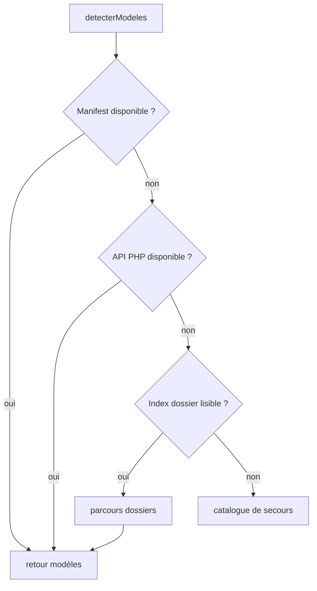

# Modèles 3D, API et déploiement

## 1. Organisation attendue des modèles

Structure type :

```text
assets/modeles/
└── NomDuModele/
    ├── modele.obj
    ├── modele.mtl
    └── textures...
```

Le nom affiché dans l'interface provient normalement du nom du dossier ou du manifeste.

## 2. Détection des modèles

`ServiceDetectionModeles3D` utilise trois stratégies, dans cet ordre :

1. manifeste JSON ;
2. API PHP ;
3. index HTML du dossier.



### Manifestes essayés

Dans `assets/modeles/` :
- `modeles.json` ;
- `manifest.json`.

### API

`api/lister_modeles.php` parcourt le serveur côté PHP lorsque l'index Apache n'est pas exposé.

### Index HTML

Utile notamment avec :

```bash
python -m http.server
```

qui expose un listing de répertoire.

## 3. Import

`ChargeurModeleBabylon` utilise :

```text
BABYLON.SceneLoader.ImportMeshAsync
```

Le chemin est encodé segment par segment pour supporter correctement les noms Unicode et espaces.

## 4. API questionnaire

### `api/enregistrer_enquete.php`

Méthode :
- POST JSON.

Fonctions :
- validation taille/méthode ;
- stockage JSON ;
- génération CSV `;` ;
- prévention de l'injection de formules tableur ;
- déduplication par identifiant ;
- stockage dans un dossier privé ;
- envoi mail optionnel.

Le script ne stocke volontairement ni IP, ni user-agent, ni identité utilisateur.

### `api/config_enquete.php`

Configure notamment :
- dossier privé ;
- destinataire ;
- expéditeur ;
- activation mail.

Des variables d'environnement peuvent surcharger une partie de cette configuration.

## 5. Environnements

### Développement local

Typiquement :
- serveur HTTP local ;
- navigateur ;
- DevTools ;
- modèles dans `assets/modeles`.

### Serveur Apache

Apache sert :
- application ;
- assets ;
- PHP.

Pour un espace public protégé, utiliser la documentation dédiée déjà produite pour :
- page publique "site en construction" ;
- sous-dossier ANNA protégé par authentification Apache.

## 6. Vérifications après déploiement

- `guiTexture.json` se charge ;
- Babylon et ses loaders sont disponibles ;
- `assets/modeles/` est lisible ;
- `api/lister_modeles.php` renvoie du JSON ;
- un OBJ se charge avec MTL/textures ;
- localStorage fonctionne ;
- questionnaire POST fonctionne ;
- dossier privé de réponses est accessible en écriture par PHP ;
- HTTPS est actif pour la version publique.
